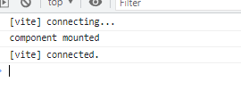

# Svelte 맛보기

## Svelte 초기 설정

1. Svelte를 설치한다.

```
npm init vite my-app -- --template svelte
cd my-app

```

그 후 실행을 하면 첫 화면이 나온다.

```
npm install
npm run dev
```

App.svelte에 보면 정말 신기하게 되어 있다.

script 영역 html영역 그리고 style영역으로 되어 있다.

```js
<script>
  import logo from './assets/svelte.png'
  import Counter from './lib/Counter.svelte'
</script>

<main>
  
  <h1>Hello world!</h1>

  <Counter />

  <p>
    Visit <a href="https://svelte.dev">svelte.dev</a> to learn how to build Svelte
    apps.
  </p>

  <p>
    Check out <a href="https://github.com/sveltejs/kit#readme">SvelteKit</a> for
    the officially supported framework, also powered by Vite!
  </p>
</main>

<style>
  :root {
    font-family: -apple-system, BlinkMacSystemFont, 'Segoe UI', Roboto, Oxygen,
      Ubuntu, Cantarell, 'Open Sans', 'Helvetica Neue', sans-serif;
  }

  main {
    text-align: center;
    padding: 1em;
    margin: 0 auto;
  }

  img {
    height: 16rem;
    width: 16rem;
  }

  h1 {
    color: #ff3e00;
    text-transform: uppercase;
    font-size: 4rem;
    font-weight: 100;
    line-height: 1.1;
    margin: 2rem auto;
    max-width: 14rem;
  }

  p {
    max-width: 14rem;
    margin: 1rem auto;
    line-height: 1.35;
  }

  @media (min-width: 480px) {
    h1 {
      max-width: none;
    }

    p {
      max-width: none;
    }
  }
</style>

```

script에 import를 하고 script 닫히는 바로 아래에 html을 불려올 수 있는데 여기서 react와 비슷하게 컴포넌트를 불려와서 렌더링 할 수 있다.

## Svelte로 라우터 지정

svelte에서 router설정하려면

```
 npm i -D svelte-routing
```

이것을 설치해준다.

설치 후

페이지 별로 보여줄 components를 만들어 주고 App.svelte에

```js
<script>
 import logo from './assets/svelte.png'
 import Counter from './lib/Counter.svelte'
 // import routes from '../routes'
 import { Router, Link, Route } from "svelte-routing";
 import Home from "./routes/Home.svelte";
 import About from "./routes/About.svelte";

 export let url = "";

</script>

<Router url="{url}">
 <nav>
   <Link to="/">Home</Link>
   <Link to="about/1">About</Link>

 </nav>
 <div>
   <!-- <Route path="blog/:id" component="{BlogPost}" /> -->
   <Route path="/"><Home /></Route>

   <Route path="about/:id" component="{About}" />
 </div>
</Router>

<style>

</style>

```

이런식으로 만들어 주면 링크를 클릭하면 잘 라우팅이 되었다.

그리고 params나 query string을 가져오고 싶으면

params는

```js
<Route path="about/:id" component="{About}" />
```

이렇게 /:id로 path를 설정해 놓으면

About.svelte의 script에서

```js
export let id;
```

이렇게 코드를 짜면 잘 나온다. query string을 가져오고 싶어서 서치를 해봤는데 query-string npm을 사용한다.

```
npm i query-string
```

```js
let parsed = {};

if (typeof window !== "undefined") {
  parsed = queryString.parse(window.location.search);
}
console.log(parsed);
```

이렇게 설정을 하면 ?token=sdfsdfsdf
이런 쿼리스트링이 있으면

parsed => {token: 'sdfsdfsdf'}

이렇게 할 수 있다.

## svelte redux와 비슷한 전역상태 관리

redux store처럼 전역상태를 관리해주는 store를 만들어 줄 수 있다.

redux와 똑같이 store를 만들어 주면 된다.

```js
import { writable } from "svelte/store";

const PollStore = writable([{ id: 1, question: "스토어 연습" }]); // 저장소가 쓰기 가능과 같다. 이게 저장소로 생성되도록 혹출하고 데이터 쓰기 가능한 저장소를 전달 할 수 있다. (redux의 store 만들고 호출하는것과 동일) 초기 데이터를 지정할 수 있다.

export default PollStore;
```

그리고 이걸 Home.svelte에서 사용하면

```js
import PollStore from "../stores/store.js";

PollStore.subscribe((data) => {
  console.log(data);
});
```

이렇게 subscribe를 통해서 가져와서 볼 수 있다.

그리고 수정을 하기 위해서는 update메서드를 이용하거나 set을 이용하면 된다.

```js
testStore.update((state) => [...state, { id: Math.max(...state.map((item) => item.id)) + 1, question: "ddd" }]);
```

그리고 redux와 다르게 mobx처럼 여러 store를 생성할 수 있어서 좋은 거 같다.

하지만 스벨트 또한 다른 컴포넌트로 변경될 때 마다 렌더를 다시 하는데 이거는 나중에 메모리 누수가 발생할 수 있다. 그래서 스벨트도 생명주기가 있다.

onMount 후크를 이용하여 최적화를 할 수 있다.

onMount는 리엑트와 같이 구성요소가 Dom 을 마운트 할 때 발생하므로 Dom에 주입될 때 데이터를 가져와야 하는 경우 데이터베이스에 접근하기에 좋은 시간이다. 즉 axios나 fetch를 이용하여 서버에서 api 호출할 때 이용할 수 있다.

```js
onMount(() => {
  console.log("component mounted");
});
```

이렇게 생명주기를 하면 첫 마운트때 실행된다.



onDestroy hook또한 react에서 unMount할때 useEffect에서 return 을 해주면 Dom 에서 제거될 때 실행이 된다.
즉 svelte도 unMount를 하기 위해서 onDestroy를 해준다.

```js
onDestroy(() => {
  console.log("component destroyed");
});
```

이제 해야할 일은 store에서 subscribe(구독)을 취소하려면

```js
const unsub = PollStore.subscribe((data) => {
  // console.log(data.a)
  a = data.a;
});
```

이 unSub를 호출하는 것이다.

```js
onDestroy(() => {
  unsub();
});
```

다른 컴포넌트나 다른 페이지로 이동할 때 스토어를 구독을 취소하므로써 메모리 누수를 막을 수 있다고 한다.

그리고 이것보다 더 쉬운 방법이 있다고 한다.

자동으로 구독 취소하는 쉬운 방법은 그냥 직접 html에 바로 접근하면 된다고 한다.

### readable

readable은 외부에서 값을 설정할 수 없는 저장소를 생성한다.
첫번째 인수는 저장소의 초기값이고 두 번째 인수 .readable은 writable 두번때 인수와 같다.

```js
const time = readable(null, (set) => {
  set(new Date());

  const interval = setInterval(() => {
    set(new Date());
  }, 1000);

  return () => clearInterval(interval);
});
```

이런식으로 설정 할 수 있다.

이렇게 store에 지정하고 외부에서 읽기 형식으로 만 가져올 수 있다. (시간 같은 걸 설정 할 수 있는거 같다.)
